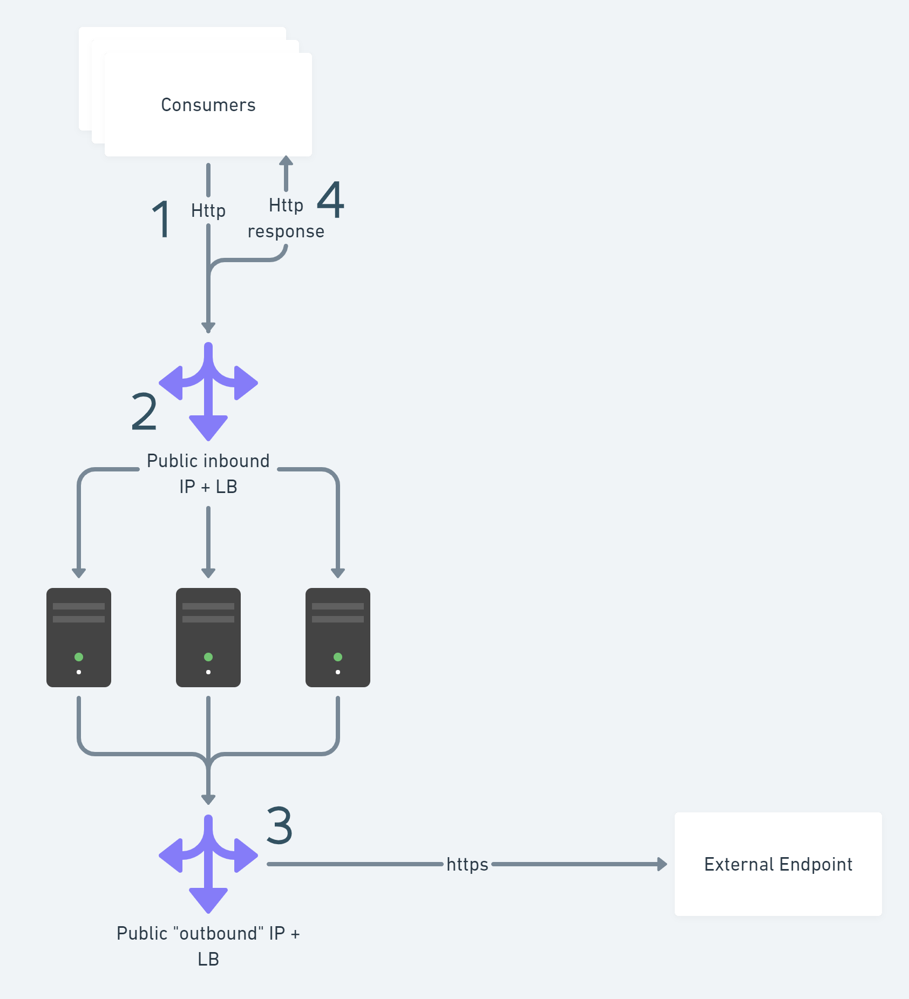

# SnatExhaustionDemo
Demo showing how you can run into a SNAT exhausion if one of your applications is not reusing sockets in AKS.

# Topology
This demo has a very simple setup. X number of consumers are making http requests to the demo application in our K8s cluster. The requests hit the public load balanser that AKS has provisioned to us by the applications K8s Service of type Load Balanser. In a non-demo environment you would typically use an ingress controller instead of exposing the application directly. The demo application is making an outbound request to an external application, in our demo an Azure Function.

# Get up and running
This application needs an external endpoint in Azure Function. Create an Azure function and fill in the secret in deploy.yaml. Run kubectl apply -f deploy.yaml in an AKS cluster with Linkerd installed.